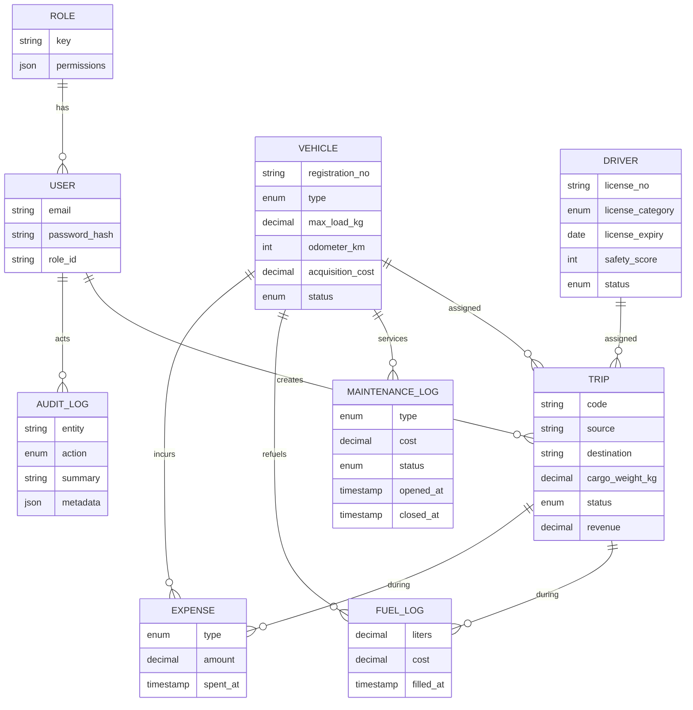

# TransitOps — Smart Transport Operations Platform

A centralized platform to manage the full lifecycle of a transport fleet — vehicles,
drivers, dispatch, maintenance, fuel & expenses, and analytics — with every business
rule enforced end to end.

Built for the Odoo Hackathon. Dark, glassmorphic UI with tasteful interactive 3D
(a live 3D fleet globe, a driving licence that rotates and fills as you type, and a
vehicle that recolours with its status).

---

## ✨ Highlights

- **Role-based access control** for four roles (Fleet Manager, Dispatcher, Safety Officer, Financial Analyst) — enforced in the API and reflected in the UI.
- **Automatic status transitions** — dispatching a trip flips the vehicle *and* driver to `On Trip`; completing/cancelling frees them; opening maintenance sends a vehicle to the shop and hides it from dispatch.
- **Business rules as guardrails** — unique registration, capacity checks, expired-licence / suspended-driver blocks, no double-booking. Violations return clear errors, never crashes.
- **Live data** — a live **Active Trips** board, polling dashboards, and an immutable audit trail powering the activity feed.
- **Fleet-by-state map** — an India choropleth showing active vehicles per state (plain SVG, no WebGL).
- **Analytics** — fuel efficiency, fleet utilization, operational cost, and per-vehicle ROI, with CSV export.
- **Light & dark themes** — a full dual-theme design system with a persisted toggle.
- **Signature 3D** — a driving licence that rotates 360° and fills **live as you type** (CSS 3D, so the text stays crisp), and a 3D vehicle that recolours with its status.

### Design
The UI is a deliberate **"logistics control room"** system — hairline rules over a faint
engineering grid, sharp geometry, monospace tabular numerics, and a single hi-vis signal
colour. There is **no `backdrop-filter`/glassmorphism anywhere**, which is both a stylistic
choice and why animation stays smooth.

---

## 🧱 Tech Stack

| Layer | Choice |
|---|---|
| Framework | **Next.js 16** (App Router) + **React 19** + **TypeScript** |
| Styling | **Tailwind CSS v4** (CSS-first theme tokens), **Framer Motion** |
| 3D | **React Three Fiber** + **drei** + **three**, plus CSS 3D |
| Charts | **Recharts** |
| Database | **PostgreSQL** |
| ORM | **Prisma 6** (engine-free client + `pg` driver adapter) |
| Auth | Email + password (**bcrypt**), signed **JWT** session cookie (**jose**), edge middleware |
| Validation | **Zod** at every API boundary |

---

## 🗂️ Architecture

Clean, layered separation — **no database queries inside route handlers**:

```
Request → middleware (auth gate)
        → app/api/**/route.ts        thin: parse → validate (Zod) → call service → uniform JSON
        → lib/services/*.service.ts  business logic + rules + transactions + audit
        → lib/db.ts (Prisma)         data access
```

```
src/
├── app/
│   ├── (app)/                 authenticated shell + pages (dashboard, vehicles, …)
│   ├── api/                   route handlers (thin controllers)
│   └── login/                 public auth page
├── lib/
│   ├── services/              business logic (one file per domain)
│   ├── validation/            Zod schemas (one file per entity)
│   ├── auth/                  session, password, RBAC
│   ├── api/                   response envelope, error handling, route wrapper
│   └── db.ts                  Prisma client (pg adapter)
├── components/
│   ├── ui/                    design-system kit (Button, Field, Table, Modal, Toast…)
│   ├── layout/                sidebar, topbar, shell, RBAC context
│   └── three/                 R3F scenes (FleetNetwork, FleetGlobe, VehicleModel)
└── prisma/
    ├── schema.prisma          data model
    ├── migrations/            committed SQL migrations
    └── seed.ts                realistic demo data
```

Every API response uses one envelope: `{ ok: true, data }` or `{ ok: false, error }`.
Errors (validation, business-rule, Prisma) are translated centrally to friendly messages.

---

## 🗄️ Database Design

Money is `DECIMAL(12,2)`, statuses are enums (DB-level `CHECK`), every table has
`created_at` / `updated_at`, foreign keys everywhere, and indexes on FKs + frequently
filtered columns. An `audit_logs` table gives an immutable history trail.



---

## 🔒 Business Rules (all enforced server-side)

- Registration number is **unique**.
- **Retired / In-Shop** vehicles never appear in dispatch selection.
- Drivers with **expired licences** or **Suspended** status cannot be assigned.
- A vehicle/driver already **On Trip** cannot be assigned to another trip.
- **Cargo weight ≤ vehicle capacity** (checked live in the UI and on the server).
- Dispatch → vehicle & driver become **On Trip**. Complete/Cancel → back to **Available**.
- Opening maintenance → vehicle **In Shop** (hidden from dispatch). Closing → **Available** (unless retired, and only if no other open jobs).

---

## 👥 Roles & Access (RBAC)

| Module | Fleet Manager | Driver | Safety Officer | Financial Analyst |
|---|---|---|---|---|
| Dashboard | View | View | View | View |
| Vehicles | **Edit** | View | View | View |
| Drivers | View | View | **Edit** | View |
| Trips | View | **Edit** | View | View |
| Maintenance | **Edit** | View | View | View |
| Fuel & Expenses | View | **Edit** | — | **Edit** |
| Reports | View | View | View | View |
| Settings | **Edit** | — | — | — |

**The matrix is hardcoded and enforced server-side on every request — it is deliberately
NOT runtime-editable.** Permissions are tied to job function; a UI that could edit them
would let a Safety Officer grant themselves dispatch rights (privilege escalation).

What the Fleet Manager *does* control dynamically is **user management**: create accounts
and **reassign a user's role at any time** (e.g. Financial Analyst → Driver) from
**Settings → Users**. Access updates immediately on their next request.

### Auth & security
- Email + password (bcrypt), signed JWT session cookie.
- **Sign-up** with role selection · **Remember me** (30-day session) · **Forgot password** (emailed, single-use, 60-min token).
- **Accounts lock for 15 minutes after 5 consecutive failed logins**; a password reset also clears the lock.
- Reset tokens are stored **hashed**; the forgot endpoint never reveals whether an email exists.

### Demo accounts (password `Transit@2026`)
| Email | Role |
|---|---|
| kavish@gmail.com | Fleet Manager |
| vatsal@gmail.com | Driver |
| harsh@gmail.com | Safety Officer |
| keval@gmail.com | Financial Analyst |

---

## 🚀 Local Setup

```bash
# 1. Install
npm install            # runs `prisma generate` automatically

# 2. Configure
cp .env.example .env   # set DATABASE_URL (Postgres) and AUTH_SECRET

# 3. Migrate + seed
npm run db:migrate     # or: npx prisma migrate deploy
npm run db:seed

# 4. Run
npm run dev            # http://localhost:3000
```

> **Note (engine-free Prisma):** the client is generated with `engineType = "client"`
> (WASM query compiler) + the `pg` driver adapter, so it runs on any architecture —
> including **Windows ARM64**, where Prisma ships no native engine. This is also what
> makes it portable to Vercel.

---

## ☁️ Deploy to Vercel + Neon

1. **Database** — create a free Postgres at [neon.tech](https://neon.tech). Copy the
   **pooled** connection string (ends with `?sslmode=require`).
2. **Push to GitHub** — create a repo and push this project.
3. **Import to Vercel** — [vercel.com/new](https://vercel.com/new) → import the repo.
4. **Environment variables** (Project → Settings → Environment Variables):
   - `DATABASE_URL` = your Neon pooled connection string
   - `AUTH_SECRET` = a long random string (`node -e "console.log(require('crypto').randomBytes(48).toString('base64url'))"`)
5. **Deploy.** `vercel.json` runs `prisma migrate deploy` during the build, so the schema
   is applied automatically.
6. **Seed once** (from your machine, pointing at Neon):
   ```bash
   DATABASE_URL="<neon-url>" npm run db:seed
   ```

That's it — the app is live.

---

## 🌿 Git Workflow (4-member ownership)

Work is split into four owned modules so every member has real, attributable commits:

| Member | Module | Key files |
|---|---|---|
| **A** | Foundation, Auth & RBAC | `lib/auth/*`, `lib/api/*`, `middleware.ts`, `app/login`, `app/(app)/settings`, `prisma/*` |
| **B** | Fleet & Maintenance | `app/(app)/vehicles`, `app/(app)/maintenance`, vehicle/maintenance services & validation, `components/three/VehicleModel` |
| **C** | People & Dispatch | `app/(app)/drivers`, `app/(app)/trips`, driver/trip services & validation, `components/DriverLicense3D` |
| **D** | Money & Insight | `app/(app)/dashboard`, `app/(app)/fuel`, `app/(app)/reports`, fuel/expense/report/dashboard services, `components/three/FleetGlobe` |

Convention: branch per feature (`feat/<module>`), small commits, PR into `main` reviewed
by a teammate. See `GIT_WORKFLOW.md` for the exact commit plan.

---

## 📜 Scripts

| Command | Purpose |
|---|---|
| `npm run dev` | Start dev server |
| `npm run build` | Production build |
| `npm run db:migrate` | Create/apply a migration (dev) |
| `npm run db:seed` | Seed demo data |
| `npm run db:reset` | Reset + reseed |
